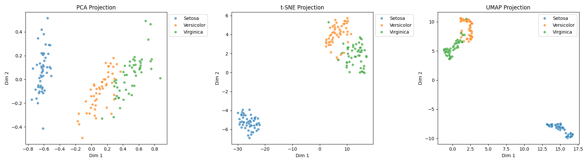
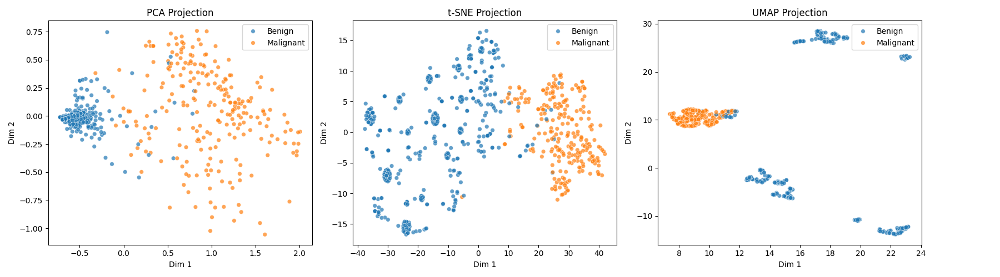

# DimensionalityReductionPlotter

Visualizing results of popular dimensionality reduction methods.

## Examples

Fisher Iris data (4-D):

Wisconsin Breast Cancer Diagnostic (9-D):

## License

This project is freely available for both private and commerical use under the [MIT license](LICENSE).
