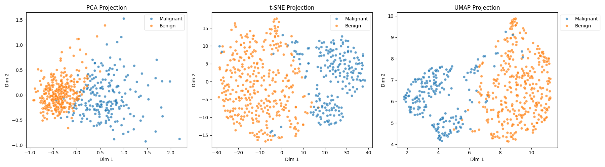
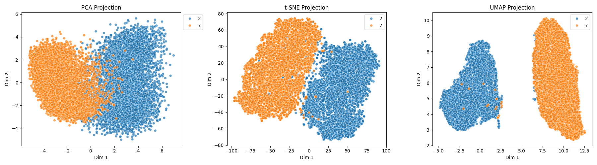
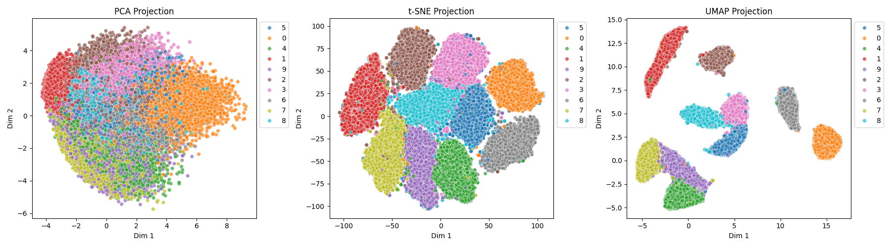

# DimensionalityReductionPlotter

Visualizing results of popular dimensionality reduction methods using two-dimensional projections.

## Examples

Fisher Iris (4 attributes, 3 classes, 150 cases):

Wheat Seeds (7 attributes, 3 classes, 210 cases):

Wisconsin Breast Cancer Diagnostic (9 attributes, 2 classes, 683 cases):

Wisconsin Breast Cancer (30 attributes, 2 classes, 569 cases):

MNIST 2v7 (784 attributes, 2 classes, 12,223 cases):

MNIST (784 attributes, 10 classes, 60,000 cases)

## License

This project is freely available for both private and commerical use under the [MIT license](LICENSE).
